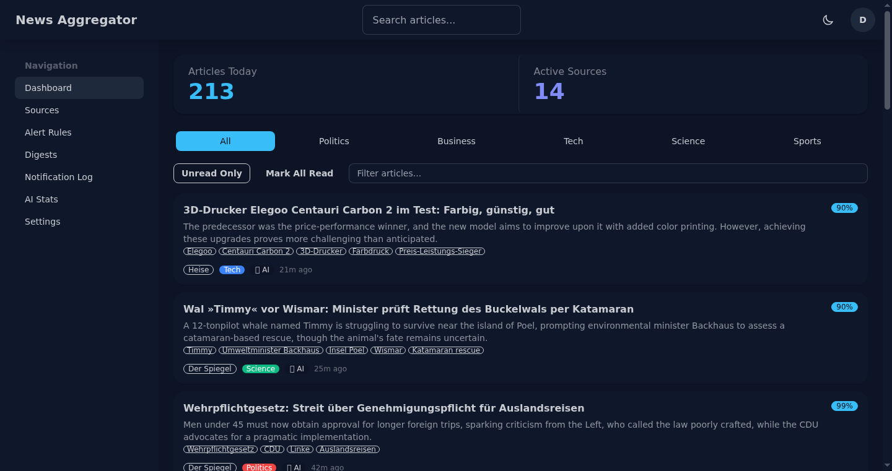
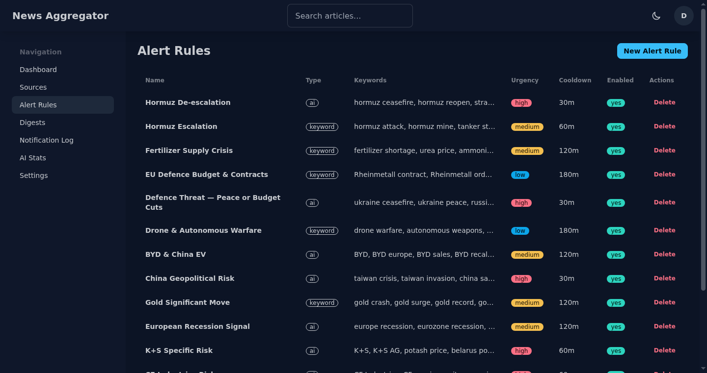
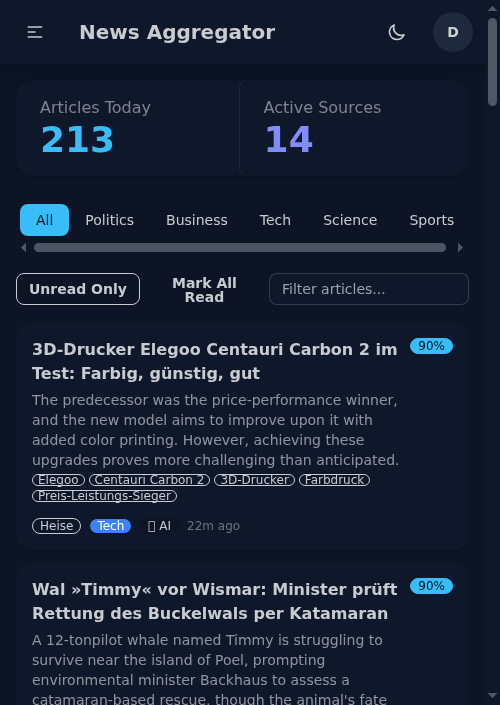

# News Aggregator

[](https://github.com/tony-stark-eth/news-aggregator/actions/workflows/ci.yml)
[](LICENSE)
[](https://php.net)

Self-hosted, AI-enhanced RSS/Atom news aggregator built with Symfony 8 + FrankenPHP.



|  |  |
|---|---|
| Alert rules with portfolio monitoring | Mobile-responsive layout |

## Features

- **RSS/Atom feed aggregation** from configurable sources
- **AI-powered categorization & summarization** via OpenRouter free models (with rule-based fallback)
- **Keyword extraction** — AI-extracted entities (people, orgs, places) displayed as tags, searchable
- **Article translation** — automatic title/summary translation based on source language (original preserved)
- **Smart alerts** with keyword and AI-based evaluation
- **Alert rule fixtures** — define alert strategies in YAML files, load via CLI
- **Periodic digests** with AI-generated editorial summaries
- **Full-text search** via SEAL + Loupe (zero infrastructure, SQLite-based) with auto-reindexing
- **Inline article filter** — client-side search-as-you-type on the dashboard
- **Article scoring & ranking** based on recency, source reliability, and category weights
- **Deduplication** across sources (URL, title similarity, content fingerprint)
- **Data retention** with configurable cleanup intervals
- **Scheduled maintenance** — daily search reindex + cleanup via Symfony Scheduler
- Single-user auth, multi-user ready architecture

## Tech Stack

- **Backend**: Symfony 8.0, PHP 8.4, Doctrine ORM
- **Server**: FrankenPHP + Caddy (automatic HTTPS, HTTP/3)
- **Database**: PostgreSQL 17 + PgBouncer (connection pooling)
- **Frontend**: Twig + DaisyUI + plain TypeScript (via Bun + AssetMapper)
- **AI**: Symfony AI Bundle + OpenRouter (free models, ModelFailoverPlatform)
- **Search**: SEAL + Loupe (SQLite-based, swap to Meilisearch later)
- **Async**: Symfony Messenger (Doctrine transport)
- **Monitoring**: Ember (Caddy/FrankenPHP metrics TUI)

## Requirements

- Docker & Docker Compose v2
- (Optional) OpenRouter API key for AI features

## Quick Start

### Option A: Pull from GHCR (recommended)

```bash
# Pull the latest image
docker pull ghcr.io/tony-stark-eth/news-aggregator:latest

# Download the compose files
curl -O https://raw.githubusercontent.com/tony-stark-eth/news-aggregator/main/compose.yaml
curl -O https://raw.githubusercontent.com/tony-stark-eth/news-aggregator/main/compose.prod.yaml

# Copy and edit env
curl -O https://raw.githubusercontent.com/tony-stark-eth/news-aggregator/main/.env.example
cp .env.example .env.local
# Edit .env.local: set ADMIN_EMAIL, ADMIN_PASSWORD_HASH, and optionally OPENROUTER_API_KEY

# Start
docker compose -f compose.yaml -f compose.prod.yaml up -d

# Access at https://localhost:8443
```

### Option B: Build from source

```bash
git clone https://github.com/tony-stark-eth/news-aggregator.git
cd news-aggregator
cp .env.example .env.local
# Edit .env.local
make start

# Access at https://localhost:8443
# (Accept the self-signed certificate on first visit)
```

## Configuration

Copy `.env.example` to `.env.local` and adjust:

| Variable | Description | Example |
|----------|-------------|---------|
| `ADMIN_EMAIL` | Admin login email | `admin@example.com` |
| `ADMIN_PASSWORD_HASH` | Bcrypt hash of admin password | `$2y$13$...` |
| `OPENROUTER_API_KEY` | OpenRouter API key (optional) | `sk-or-...` |
| `NOTIFIER_CHATTER_DSN` | Notification transport DSN | see below |
| `FETCH_DEFAULT_INTERVAL_MINUTES` | How often to fetch feeds | `60` |
| `RETENTION_ARTICLES` | Article retention period | `90` |
| `RETENTION_LOGS` | Notification/digest log retention | `30` |

Generate `ADMIN_PASSWORD_HASH`:
```bash
docker compose exec php php bin/console security:hash-password
```

## Notification Setup

Notifications use Symfony Notifier. Install a transport package, then set the DSN.

### Popular transports

```bash
# Pushover (recommended for Android)
composer require symfony/pushover-notifier
# DSN: pushover://USER_KEY@TOKEN

# Telegram
composer require symfony/telegram-notifier
# DSN: telegram://BOT_TOKEN@default?channel=CHAT_ID

# Slack
composer require symfony/slack-notifier
# DSN: slack://TOKEN@default?channel=CHANNEL

# Discord
composer require symfony/discord-notifier
# DSN: discord://TOKEN@default?webhook_id=ID&webhook_token=TOKEN

# Email (via Mailer)
composer require symfony/mailer
# DSN: mailto://from@example.com?to=you@example.com
```

Set in `.env.local`:
```dotenv
NOTIFIER_CHATTER_DSN=pushover://USER_KEY@TOKEN
```

## Alert Rules

Alert rules watch incoming articles and send notifications when matched.

### Loading from fixtures

Define alert strategies in YAML and load them via CLI:

```bash
make sf c="app:load-alert-rules fixtures/alert-rules/portfolio.yaml"
make sf c="app:load-alert-rules fixtures/alert-rules/"  # load all files in directory
make sf c="app:load-alert-rules fixtures/alert-rules/portfolio.yaml --dry-run"  # preview
make sf c="app:load-alert-rules fixtures/alert-rules/portfolio.yaml --purge"    # remove rules not in file
```

Fixture format (`fixtures/alert-rules/portfolio.yaml`):
```yaml
- name: "Hormuz De-escalation"
  type: ai
  keywords: ["hormuz ceasefire", "iran diplomacy", "iran peace deal"]
  context_prompt: "I hold CF Industries and K+S stocks that profit from the Hormuz blockade..."
  urgency: high
  severity_threshold: 6
  cooldown_minutes: 30
```

### Creating via UI

Navigate to **Alerts** in the sidebar. Each rule has a **type**:

| Type | Behavior |
|------|----------|
| `keyword` | Matches if any keyword appears in title/summary. Fast, no AI calls. |
| `ai` | Sends all articles to AI for evaluation against a context prompt. |
| `both` | Keyword match first, then AI confirms on keyword hits only (~10-20 AI calls/day). |

### Creating an alert rule

Navigate to **Alerts** in the sidebar, then:

1. Enter a **name** (e.g. "AI funding news")
2. Choose **type**: `keyword`, `ai`, or `both`
3. **Keywords** (for `keyword`/`both`): comma-separated terms, e.g. `OpenAI, Anthropic, funding round`
4. **Categories**: optionally restrict to specific categories
5. **Context prompt** (for `ai`/`both`): describe what to match, e.g.:
   > "Alert me when there is news about AI startup funding rounds over $10M. Ignore incremental product updates."
6. **Urgency**: `normal` or `high` (high = immediate notification)

## Digest Configuration

Digests are periodic AI-generated editorial summaries. Navigate to **Digests** to create a schedule.

| Setting | Description |
|---------|-------------|
| **Cron expression** | When to generate, e.g. `0 8 * * *` (daily 8am) |
| **Categories** | Which categories to include (leave empty for all) |
| **Max articles** | How many articles to summarize (default: 20) |
| **Prompt** | Custom instructions for the AI editor |

The digest processor runs every 5 minutes and checks which schedules are due.

## AI Integration

AI features use [OpenRouter](https://openrouter.ai) free models via `symfony/ai-bundle`.

- **No API key required** — the system falls back to rule-based categorization/summarization.
- **Primary model**: `openrouter/free` — auto-routes to the best available free model.
- **Failover chain**: If `openrouter/free` is unavailable, `ModelFailoverPlatform` tries minimax, glm, gpt-oss, qwen, and nemotron in sequence.
- **Quality gates**: AI responses are validated for structure and confidence (>= 0.7). Low-confidence results fall back to rule-based output.
- **Keyword-first alerts**: For `both`-type rules, AI is only invoked on keyword matches — typically 10-20 AI calls per day.
- **Blocked models**: Set `OPENROUTER_BLOCKED_MODELS=model-id-1,model-id-2` to permanently skip unreliable models.
- **Stats**: Run `make sf c="app:ai-stats"` to see model quality metrics.

### AI enrichment pipeline

Each fetched article goes through this pipeline:

1. **Categorization** — assigns a category (politics, tech, business, science, sports)
2. **Summarization** — generates a 1-2 sentence summary
3. **Keyword extraction** — extracts 3-5 key entities (people, organizations, places, topics)
4. **Translation** — translates title and summary if the source language differs from English

All four steps use the same decorator pattern: AI tries first, rule-based fallback on failure. Keywords and translations are stored alongside the original content.

### Source language & translation

Sources have a `language` field (e.g. `de`, `en`). When a source's language is not English, the AI translates the title and summary after enrichment. The original text is preserved (`titleOriginal`, `summaryOriginal`) and shown via a tooltip on the article card.

Add a language when creating a source in the UI, or set it in the seed data.

## Search

Articles are indexed via SEAL + Loupe (SQLite-based, zero infrastructure). Search covers title, content, summary, source name, category, and extracted keywords.

- **Navbar search** — full-text search via `/search?q=...`
- **Inline filter** — type in the filter input above the dashboard article list for instant client-side filtering
- **Auto-reindex** — new articles are indexed automatically via a Doctrine event listener. A daily full reindex runs as a safety net via the maintenance scheduler.
- **Manual reindex**: `make sf c="app:search-reindex"`

## Data Retention

Old articles and logs are pruned automatically by the `app:cleanup` command (run daily via the maintenance scheduler).

| Variable | Default | Description |
|----------|---------|-------------|
| `RETENTION_ARTICLES` | `90` | Articles older than this are deleted |
| `RETENTION_LOGS` | `30` | Notification and digest logs older than this are deleted |

Run manually:
```bash
make sf c="app:cleanup"
```

## Architecture

Domain-driven design with bounded contexts. See [docs/architecture.md](docs/architecture.md) for the full diagram.

```
Article    → core articles, scoring, deduplication
Source     → feed management, fetching, health tracking
Enrichment → rule-based + AI categorization/summarization
Notification → unified alert rules + Notifier dispatch
Digest     → periodic AI-generated editorial summaries
User       → authentication, per-user read state
Shared     → AI infra, search, categories, cleanup commands
```

See [docs/article-lifecycle.md](docs/article-lifecycle.md) for the article pipeline diagram.

## Development

```bash
make up              # Start containers
make down            # Stop containers
make sh              # Shell into PHP container
make quality         # Run all quality checks (ECS + PHPStan + Rector)
make test            # Run all tests
make test-unit       # Run unit tests
make test-integration # Run integration tests
make infection       # Run mutation testing
make coverage        # Generate coverage report
make hooks           # Install git hooks
make ts-build        # Compile TypeScript
```

## Contributing

See [CONTRIBUTING.md](CONTRIBUTING.md).

## Security

See [SECURITY.md](SECURITY.md) for the vulnerability disclosure policy.

## License

[MIT](LICENSE)
