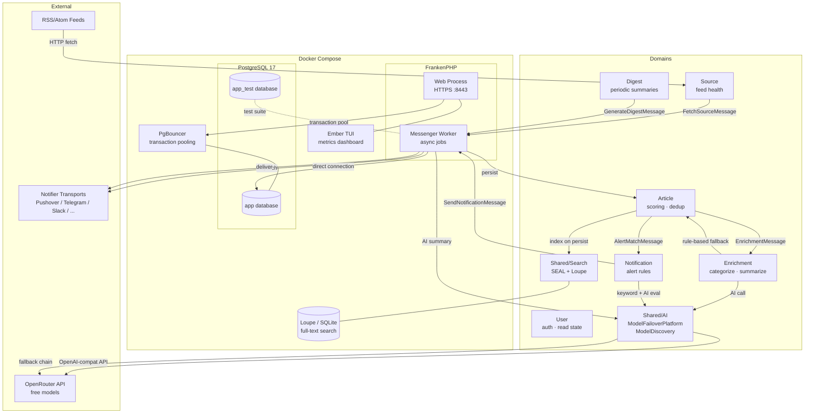

# System Architecture

## Overview

News Aggregator is a self-hosted Symfony 8 application running inside Docker Compose. The system aggregates RSS/Atom feeds, enriches articles with AI, dispatches notifications, and generates periodic digests.

## Domain Boundaries

| Domain | Responsibility | Key Entities |
|--------|---------------|--------------|
| **Article** | Core articles, scoring, deduplication | `Article`, `ArticleFingerprint` |
| **Source** | Feed management, health tracking, fetch scheduling | `Source`, `SourceHealth` |
| **Enrichment** | Rule-based + AI categorization/summarization | `EnrichmentResult`, `AiQualityGate` |
| **Notification** | Alert rules, keyword/AI matching, dispatch | `AlertRule`, `NotificationLog` |
| **Digest** | Periodic schedules, AI editorial summaries | `DigestConfig`, `DigestLog` |
| **User** | Auth, per-user read state | `User`, `UserArticleRead` |
| **Shared/AI** | ModelFailoverPlatform, discovery, quality tracking | `ModelId`, `ModelQualityStats` |
| **Shared/Search** | SEAL + Loupe integration, search index sync | `ArticleSearchServiceInterface` |
| **Shared/Entity** | Category (shared lookup across domains) | `Category` |

## External Dependencies

| Service | Purpose | Required |
|---------|---------|----------|
| OpenRouter (`openrouter/free`) | AI categorization, summarization, alert eval, digests | No (rule-based fallback) |
| Notifier transport (Pushover, Telegram, Slack, ...) | Notification delivery | No (alerts disabled without DSN) |
| RSS/Atom feeds | News sources | Yes (core feature) |

## Port Map

| Port | Service |
|------|---------|
| `8443` | HTTPS (FrankenPHP/Caddy) |
| `8180` | HTTP (FrankenPHP/Caddy) |
| `5432` | PostgreSQL (internal) |
| `6432` | PgBouncer (internal) |
