# Article Lifecycle

The complete pipeline from RSS feed to notification/digest.

```mermaid
flowchart TD
    A([RSS/Atom Feed]) --> B[FeedFetcherService\nHTTP GET feed URL]
    B --> C{HTTP OK?}
    C -->|No| D[Increment source.error_count\nUpdate last_error_message]
    D --> E{error_count >= 5?}
    E -->|Yes| F[Set source.health = disabled\nStop scheduling]
    E -->|No| G[Set source.health = degraded]

    C -->|Yes| H[FeedParserService\nlaminas/laminas-feed\nparse items]
    H --> I[For each feed item]
    I --> J[DeduplicationService\ncheck URL + fingerprint]
    J --> K{Duplicate?}
    K -->|Yes| L[Skip — article already exists]
    K -->|No| M[Persist Article\nstore raw HTML + stripped text]

    M --> N[ScoringService\ncalculate initial score\nrecency + source weight + category weight]
    N --> O[Index in Loupe\nfull-text search]

    O --> P{OPENROUTER_API_KEY set?}
    P -->|Yes| Q[AiCategorizationService\ndecorates RuleBasedCategorizationService]
    P -->|No| R[RuleBasedCategorizationService\nkeyword → category map]

    Q --> S[ModelFailoverPlatform\nopenrouter/free → fallback chain]
    S --> T[AiQualityGateService\nvalidate structure\nconfidence >= 0.7\nlength heuristic]
    T -->|Pass| U[Store category + EnrichmentMethod.AI]
    T -->|Fail| R

    R --> U2[Store category + EnrichmentMethod.RuleBased]
    U --> V[AiSummarizationService\nor RuleBasedSummarizationService]
    U2 --> V

    V --> W[Article fully enriched\ncategory + summary + method stored]

    W --> X[AlertRule matching]
    X --> Y{Rules for this category?}
    Y -->|No| Z([Done — visible in feed])
    Y -->|Yes| AA[ArticleMatcherService]

    AA --> AB{Rule type?}
    AB -->|keyword| AC[Keyword match\nscan title + summary]
    AB -->|ai| AD[AiAlertEvaluationService\nsend to OpenRouter]
    AB -->|both| AC

    AC --> AE{Keyword matched?}
    AE -->|No| Z
    AE -->|Yes, type=keyword| AF[SendNotificationMessage]
    AE -->|Yes, type=both| AD

    AD --> AG{AI: relevant?}
    AG -->|No| Z
    AG -->|Yes| AF

    AF --> AH[Messenger worker\nSendNotificationHandler]
    AH --> AI[NotificationDispatchService\nSymfony Notifier]
    AI --> AJ([Pushover / Telegram / Slack / ...])
    AI --> AK[NotificationLog persisted]

    W --> AL{Digest schedules due?}
    AL -->|No| Z
    AL -->|Yes| AM[app:process-digests\nruns every 5 min]
    AM --> AN[DigestGeneratorService\ncollect articles by category + timeframe]
    AN --> AO[DigestSummaryService\nAI editorial summary via OpenRouter]
    AO --> AP[Send digest via Notifier]
    AP --> AQ[DigestLog persisted]
    AQ --> Z
```

## Key Design Decisions

| Stage | Decision | Rationale |
|-------|----------|-----------|
| Deduplication | Global (not per-user) | Same article stored once; read state is per-user via `UserArticleRead` |
| Enrichment | Rule-based first, AI decorator | AI is enhancement layer, not dependency. System always functions without OpenRouter. |
| Alert matching | Keyword first, AI second | Reduces AI calls to ~10-20/day vs ~250/day for AI-first |
| AI failover | `openrouter/free` → `ModelFailoverPlatform` chain | Zero maintenance primary; named fallbacks for resilience |
| Quality gate | Confidence >= 0.7 + structure validation | Low-confidence AI output falls back to rule-based silently |
| Digest scheduling | Periodic command every 5 min | Avoids Symfony Scheduler compile-time limitation with dynamic schedules |
