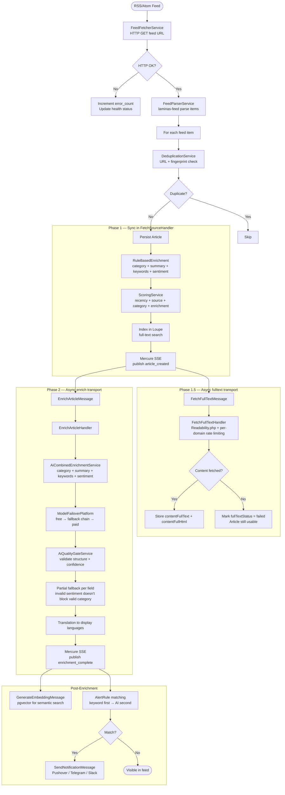

# Article Lifecycle

The complete pipeline from RSS feed to enriched, searchable article.

## Three-Phase Pipeline

## Sentiment Scoring

Sentiment is extracted at two points:
- **Phase 1 (sync)**: Rule-based scoring via ~30 positive/negative keyword lists, title weighted 2x, capped at ±0.8
- **Phase 2 (async)**: AI extracts sentiment_score (-1.0 to +1.0) in the same API call as category/summary/keywords (zero extra cost)
- **Backfill**: `app:backfill-sentiment` dispatches `ScoreSentimentMessage` to async_enrich queue for articles without scores

The navbar sentiment slider (-10 to +10) controls:
- Dashboard ranking: articles re-ordered by `COALESCE(sentiment_score, 0) * sliderFactor`
- Dashboard filtering: at ±6-10, opposite-sentiment articles are filtered (null always included)
- Chat tone: system prompt adapts (hopeful at +4+, critical at -4-)
- Digest generation: article selection and AI prompt framing follow slider

## Messenger Transports

| Transport | Queue | Consumers | Messages |
|-----------|-------|-----------|----------|
| async | default | worker | FetchSourceMessage, SendNotificationMessage, GenerateDigestMessage, RescoreArticlesMessage |
| async_fulltext | fulltext | fulltext-worker | FetchFullTextMessage |
| async_enrich | enrich | enrichment-worker | EnrichArticleMessage, GenerateEmbeddingMessage, ScoreSentimentMessage |

## Key Design Decisions

| Stage | Decision | Rationale |
|-------|----------|-----------|
| Deduplication | Global (not per-user) | Same article stored once; read state is per-user via `UserArticleRead` |
| Enrichment | Rule-based first, AI decorator | AI is enhancement layer, not dependency. System always functions without OpenRouter |
| Three-phase | Sync → async fulltext → async enrich | Articles appear instantly with rule-based data, get full-text, then upgrade with AI |
| Alert matching | Keyword first, AI second | Reduces AI calls to ~10-20/day vs ~250/day for AI-first |
| AI failover | `openrouter/free` → `ModelFailoverPlatform` chain | Zero maintenance primary; named fallbacks for resilience |
| Quality gate | Per-field validation with partial fallback | Invalid sentiment doesn't block valid category/summary |
| Sentiment | Same enrichment call, not separate | Zero extra API cost; rule-based always available as fallback |
| Full-text failures | Never block pipeline | Article remains usable with feed content; Phase 2 enrichment proceeds regardless |
